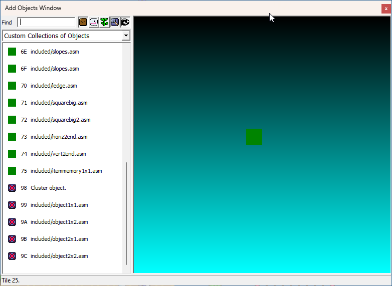
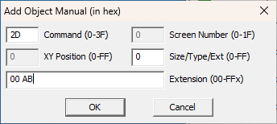
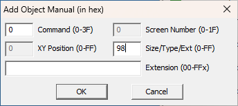

# Inserting objects

## Downloading ObjecTool

The latest release of ObjecTool can always be found on [GitHub](https://github.com/arinsuwu/objectool/releases).  
By default, two variants are provided:
- The `static` variant uses the static Asar library.
- The `dynamic` variant uses the Asar dll.

Here's my recommendation of which one to choose:
- If you're using [Callisto](https://github.com/Underrout/callisto/tree/main/callisto), use the `dynamic` variant, as Callisto uses a custom Asar dll.
- If you're not using Callisto, use the `static` variant.

## The list file

Entries for custom objects in your list are lines of the form
```
<object_number> <word_parameter> <filename>
```
where:
- `object_number` is in which slot you will insert your custom object.
  - Standard and extended objects do not share numbers. For example, you can have standard object `A0` and extended object `A0` without issue.
  - Extended objects can be inserted in slots `98-FF`.
  - If you're not using Retry's Multiple Midway Points, standard objects can be inserted in slots `00-FF`.
  - If you're using Retry's Multiple Midway Points, standard objects can be inserted in slots `42-4F` and `52-FF`.
- `word_parameter` is a special hexadecimal value, which you can think of as an extra byte. You can access it in object code via the `!word_param` define, as well as the `standard_word_params` and `extended_word_params` tables. It is optional: not including it will default to `0000`.
- `filename` is the asm file which contains your object code.
  - By default, objects live in the `objects` folder, but this can be changed via a [CLI setting](#command-line-options).

Standard objects are specified by the `STANDARD:` label -- the default -- and extended objects are specified by the `EXTENDED:` label. Comments can be added if you start a line with a `;`.  
Here is an example of a valid list:
```
; This is a comment!
STANDARD:
00 0123 included/cluster.asm
01 included/square.asm

EXTENDED:
98 1 included/object1x1.asm
```
This would insert two standard objects: number `00` with word parameter `$0123`, and number `01` with word parameter `$0000`. It would also insert one extended object: number `98` with word parameter `$0001`.

The list file also has two additional commands: `@osc` and `@mw0t`. These respectively allow you to add new entries directly to the .osc and .mw0/t files respectively. These lines are added as is to both files, *except* for lines containing the `STANDARD:` and `EXTENDED:` labels, used to write the adequate info to the Lunar Magic list. You can put them in either command, but really they're only useful in the `@mw0t` mode.  
Here is an example of both these commands in action:
```
@osc
0	67	0	Object 67, scary...

@mw0t
EXTENDED:
67	Ominous object 67.
```

## Running ObjecTool

Running ObjecTool is as simple as opening `objectool.exe`, then dragging your ROM file and list as prompted!  
Assuming no errors were found, you will notice three new files created. They have the same name as your ROM, but with `osc`, `mw0` and `mw0t` extension. These take care of adding list entries for the *Custom Collections of Objects* in the Add Objects window of Lunar Magic.  
Let's learn how to add our objects to a level.

### Adding a custom object via the *Custom Collections of Objects*

Starting in version 3.60, Lunar Magic added a *Custom Collections of Objects* section in the *Add Objects* window. ObjecTool is able to generate information to populate said list.  
The window looks like this:



Note that:
- Standard objects look like a green water tile, which you can resize.
- Extended objects look like a purple box with a magenta `X`, and they can't be resized.
- Lunar Magic doesn't support giving these objects a custom appearance.

In here, you would add an object like you would any other. Select the one you want to add, and right click on your level.

### Adding an object manually

In case you're using an older Lunar Magic or disabled tooltip generation, you can also add objects the old way, manually.  
For both cases, while you're in Layer 1 or Layer 2 editing mode, focused on the level editor, press Insert. This will bring up the *Add Object Manual* window.

#### Standard objects

A standard object is inserted like this:
- *Command* must be `2D`.
- *Extension* has two numbers. The first will be the standard object number as you added it in the ObjecTool list. The second will be the *extra byte* of the object.

For example:



This will add standard object `00` with extra byte `AB`.

#### Extended objects

A standard object is inserted like this:
- *Command* must be `00`.
- *Size/Type/Ext* will be the extended object number as you added it in the ObjecTool list.
- Extended objects have no extra byte.

For example:



This will add extended object `98`.

## Command line options

ObjecTool includes certain command line switches, intended for more advanced users. These are added when running the tool via command line, like so:
```
objectool.exe --<switch>=<value> --<switch>=<value> [...] <rom> <list>
```
You can see all the command-line switches by running `objectool.exe --help`. The full list is:

Switch | Description
-|-
``help`` | Display the version and command line switches, then quit.
``verbose`` | Display all information (location, tooltip, routine info) per every object inserted.
``generate_tooltip`` | Whether to create .osc and .mw0/t files for LM display.
``objects_path`` | Path to the folder which contains custom objects.
``routines_path`` | Path to the folder which contains shared routines.
``osc`` | Path to an .osc file to which to append info.
``mw0`` | Path to an .mw0 file to which to append info.
``mw0t`` | Path to an .mw0t file to which to append info.

